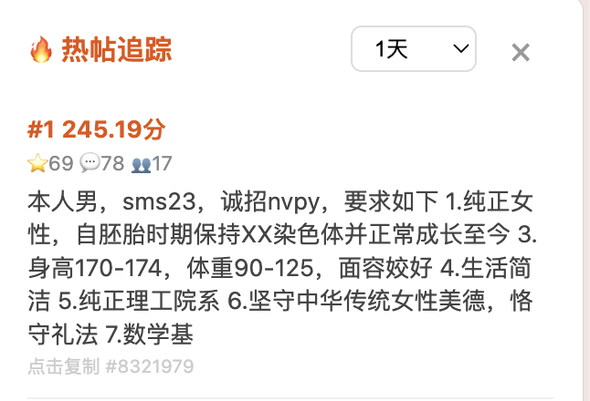

# 🔥 PKU Treehole 热帖追踪

实时追踪[北大树洞](https://treehole.pku.edu.cn)热帖，基于收藏数、评论数、独立评论人数进行两阶段热度排序，支持 5 个时间窗口。提供 Web 前端 + Edge 浏览器插件。

## 功能特性

- **两阶段热度算法**：粗筛（简单加权）→ 精排（独立评论人数 + 收藏 + 评论，含新帖时间加成）
- **5 个时间窗口**：1 小时 / 半天 / 1 天 / 3 天 / 1 周
- **Web 前端**：单页排行榜，点击条目复制帖子 ID
- **Edge 插件**：可展开侧边栏，随时查看热帖
- **智能缓存**：三级缓存（响应 / 页面 / 评论人数），避免重复请求

## 效果预览



## 环境要求

- **Python** ≥ 3.9
- **pip** 可联网安装依赖
- **Edge 浏览器**（用于安装插件，可选）
- **北大树洞账号**（学号 + 密码 + PKU Helper 手机令牌）

## 快速开始

### 1. 克隆项目

```bash
git clone <repo-url>
cd pku-treehole-trending
```

### 2. 配置账号

```bash
cp backend/config.template.py backend/config_private.py
```

编辑 `backend/config_private.py`，填入你的学号和密码：

```python
USERNAME = "你的学号"
PASSWORD = "你的密码"
```

### 3. 安装依赖

```bash
pip install -r backend/requirements.txt
```

### 4. 首次登录（获取 Cookies）

首次使用需要交互式登录完成手机令牌验证：

```bash
cd backend && python3 -c "
from client import TreeholeClient
from config_private import USERNAME, PASSWORD
c = TreeholeClient()
c.ensure_login(USERNAME, PASSWORD, interactive=True)
print('登录成功')
"
```

按提示输入 PKU Helper App 中的 6 位手机令牌。Cookies 会保存到 `~/.treehole_cookies.json`，之后启动服务无需重复验证。

### 5. 启动后端

```bash
cd backend && python3 main.py
```

服务运行在 `http://localhost:8765`。

### 6. 打开前端

浏览器打开 `frontend/index.html`，选择时间窗口即可查看热帖排行。

或直接调用 API：

```bash
curl "http://localhost:8765/api/trending?window=1d&limit=10"
```

## API 接口

### `GET /api/health`

健康检查。

```json
{ "status": "ok", "treehole_connected": true }
```

### `GET /api/trending?window=1d&limit=10`

获取热帖排行。

| 参数 | 类型 | 默认值 | 说明 |
|------|------|--------|------|
| window | string | `1d` | `1h`, `0.5d`, `1d`, `3d`, `7d` |
| limit | int | `10` | 返回数量（1-50） |

响应示例：

```json
{
  "window": "1d",
  "generated_at": 1781717000,
  "count": 10,
  "posts": [
    {
      "rank": 1,
      "pid": 8321979,
      "text": "帖子正文...",
      "timestamp": 1781713646,
      "likenum": 69,
      "reply": 78,
      "unique_commenters": 17,
      "final_score": 245.19
    }
  ]
}
```

## Edge 插件安装

1. 打开 Edge 浏览器，访问 `edge://extensions/`
2. 开启左下角「开发人员模式」
3. 点击「加载解压缩的扩展」
4. 选择项目的 `extension/` 目录
5. 插件安装完成：

   - **侧边栏**：访问 `treehole.pku.edu.cn` 时，页面右侧出现橙色 🔥 按钮，点击展开热帖面板，再次点击 × 收起
   - **弹窗**：点击浏览器工具栏插件图标，弹出热帖排行
   - **复制 ID**：点击任意条目复制帖子 ID 到剪贴板

## 热度算法

### 第一阶段：粗筛

```
coarse_score = likenum × 2 + reply × 3
```

遍历时间窗口内所有帖子，取 Top 100 进入精排。

### 第二阶段：精排

```
base_score = U × 5  +  reply^0.7 × 3  +  likenum^0.7 × 5

bonus(t) = 0.75 × max(0, 1 - t)        # t = 距现在的小时数

final_score = base_score × (1 + bonus(t))
```

| 符号 | 含义 | 权重 |
|------|------|------|
| U | 独立评论人数 | 5 |
| reply | 评论总数 | 3 (power 0.7 缩放) |
| likenum | 收藏数 | 5 (power 0.7 缩放) |
| t | 发帖距今小时数 | t<1 线性加成，t≥1 无衰减 |

### 时间加成

新帖在发帖 1 小时内获得线性递减加成（最大 1.75 倍），1 小时后无加成也无衰减。

## 性能

| 窗口 | 冷启动耗时 | 缓存命中 |
|------|-----------|---------|
| 1h | ~5s | <0.1s |
| 半天 | ~15s | <0.1s |
| 1d | ~55s | <0.1s |
| 3d | ~2.5min | <0.1s |
| 1w | ~6min | <0.1s |

## 项目结构

```
pku-treehole-trending/
├── backend/
│   ├── main.py              # FastAPI 入口
│   ├── trending.py          # 热度算法
│   ├── collector.py         # 数据采集
│   ├── client.py            # Treehole API 客户端
│   ├── config.template.py   # 配置模板
│   ├── config_private.py    # 私有配置（gitignored）
│   └── requirements.txt
├── frontend/
│   ├── index.html           # Web 页面
│   ├── style.css
│   └── app.js
├── extension/
│   ├── manifest.json        # Edge 插件配置
│   ├── popup.html           # 插件弹窗
│   └── sidebar.js           # 侧边栏注入
└── docs/
    ├── specs/               # 产品规格
    └── plans/               # 实现计划
```

## 期待贡献

欢迎提交 PR！以下是一些希望完善的方向：

### 更合理的缓存和请求设计

- 后端启动时预热缓存（预拉取常用窗口的页面数据）
- 增量更新而非全量重拉（利用帖子 ID 单调递增的特性）
- 大窗口请求时前端异步返回第一批结果，后续结果流式追加
- 更智能的超时和重试策略

### 更好看的 UI

- 契合树洞网页版的配色和风格
- 帖子详情预览（点击展开原文 + 热评）
- 热度趋势图

### 更合理的热度分数计算

- 根据实际热帖数据反馈调优权重参数
- 引入 Reddit/HN 风格的置信度排序以更好地处理新帖

## License

MIT